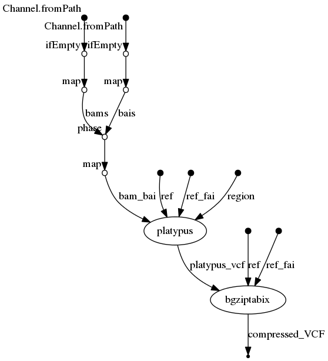

# Platypus-nf
## Germline variant calling with platypus


## Description
Perform germline variant calling with platypus, with optional use of optimized parameters based on performance analysis on [Illumina Platinium Genome](https://www.illumina.com/platinumgenomes.html) (both whole exome/genome sequencing).

The platypus nextflow pipeline can also add a step to the variant calling:
  * compress (`bgzip`) and index (`tabix`). These two tools are part of the [samtools/htslib](http://www.htslib.org/doc/) C library, see documentation for the installation. 

## Dependencies

1. This pipeline is based on [nextflow](https://www.nextflow.io). As we have several nextflow pipelines, we have centralized the common information in the [IARC-nf](https://github.com/IARCbioinfo/IARC-nf) repository. Please read it carefully as it contains essential information for the installation, basic usage and configuration of nextflow and our pipelines.

2. Platypus: see official installation [here](https://github.com/andyrimmer/Platypus). You can avoid installing all the external software by only installing Docker. See the [IARC-nf](https://github.com/IARCbioinfo/IARC-nf) repository for more information.


## Input
  | Type      | Description     |
  |-----------|---------------|
  | --input_folder | Folder containing BAM files  |
  | --ref | Path fo fasta reference  |

## Parameters

  * #### Optional
  | Name             | Example value               | Description  |
  |------------------|-----------------------------|--------------|
  | --platypus_bin  | /usr/bin/Platypus.py        | path to platypus executable |
  | --region         | chr1;chr1:0-1000; mybed.bed | region to call |
  | --cpu            |            12 | number of cpu used by platypus |
  | --mem            |            4 | memory in GB used by platypus |
  | --output_folder  |            . | folder to store output vcfs |
  | --options        | " --scThreshold=0.9 --qdThreshold=10 " | options to pass to platypus |


  * #### Flags

Flags are special parameters without value.

| Name      | Description     |
|-----------|-----------------|
| --help    | Display help |
| --compression  | compress and index the VCF file  |
| --optimized    |  use optimized parameters: --badReadsThreshold=0 --qdThreshold=0 --rmsmqThreshold=20 --hapScoreThreshold=10 --scThreshold=0.99 |

## Download test data set
  ```
  git clone https://github.com/iarcbioinfo/data_test
  ```

## Usage
  ```
  nextflow run iarcbioinfo/platypus-nf -with-docker --input_folder data_test/BAM/ --ref data_test/REF/17.fasta
  ```

## Output
  | Type      | Description     |
  |-----------|---------------|
  | VCFs    | one VCF by input BAM |

## Directed Acyclic Graph
[](http://htmlpreview.github.io/?https://github.com/IARCbioinfo/platypus-nf/blob/dev/dag.html)


## Contributions

  | Name      | Email | Description     |
  |-----------|---------------|-----------------|
  | Tiffany Delhomme*    | delhommet@students.iarc.fr | Developer to contact for support (link to specific gitter chatroom)
